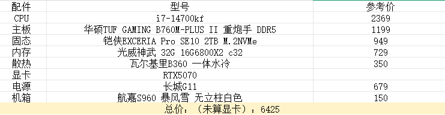

## I`m huaju-TaGuang
您好啊，我是一名04年的程序员
- 于22年开始编程，目前依旧在从事Web开发。
- 我主要开发.Net，乐于研究的热门前端框架如Vue、React。
- 正在努力开发自身，并在研究C++进行嵌入式开发和Python进行Ai开发（本地运行别人的AI模型玩）。

## 我在doing什么？
- 欲想成其事，必先利其器，我在研究电脑的硬件搭配，没错我还在尝试玩硬件。
  目前的理想配置单如下：
  

## 嘿，也许不一样
别的不多说，干就完了

